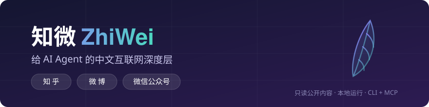

<p align="center"></p>

<p align="center">只读公开内容 · 不用登录态 · 本地运行 · 为 LLM 优化输出</p>

<p align="center">
  <a href="LICENSE"></a>
  
  
  
</p>

---

## 为什么需要知微？

AI Agent 能帮你写代码、读英文网页——但中文互联网对它几乎是盲区：

- 📖 "看看知乎上大家怎么评价 xx" → **读不了**，问题下的高赞回答拿不到
- 🔥 "微博这两天在爆什么" → **搜不了**，热搜数据没有干净的获取通道
- 📰 "把这篇公众号深度文章给我读一下" → **打不开**，正文淹没在 HTML 里
- 就算读到了，也只有**原文**，没有**观点聚合、评论树、热点脉络**这些中文特有的结构

[Agent Reach](https://github.com/Panniantong/Agent-Reach) 解决了 Twitter/Reddit/B站/小红书的"能读到"；**知微专注它没覆盖的中文深度**：知乎、微博、公众号的原生提取 + **深度加工**——不是把原文丢给你，而是把观点结构喂给 agent。

## 深度层：读得到，更要读得透

| 引擎 | 命令 | 输出 |
|---|---|---|
| 🧭 **观点聚合** | `zhiwei zhihu-digest <问题>` | 高赞回答的立场图谱：支持/反对/事实三阵营占比（条数+赞数双口径）、每阵营代表观点（核心句+赞数+来源）、讨论焦点关键词 |
| 📄 **TextRank 摘要** | `zhiwei wechat-summary <URL>` | 公众号长文的抽取式摘要 + 关键数据点（百分比/金额/倍数） |

两个引擎都是**确定性规则、无 LLM 依赖、可离线复现**——确定性的部分做扎实，主观综合留给调用方 agent。这是"半成品哲学"：我们不做黑盒总结，做结构化的思考素材。

## 输出长什么样

**知乎热榜**（发布日真实抓取）：

```markdown
| # | 话题 | 热度 | 回答数 |
|---|---|---|---|
| 1 | [什么东西被发明出来后，莫名其妙地违背了它的用途？](https://www.zhihu.com/question/2083219865272374442) | 852 万热度 | 241 |
| 2 | [LPL 2026 冒泡赛决赛 iG 3:1 淘汰 JDG 夺得最后一张世界赛门票，如何评价这场比赛？](…) | 694 万热度 | 132 |
```

**观点聚合**（`zhihu-digest`，演示数据）：

```markdown
共聚合 4 个回答、11000 赞。焦点关键词：政策、数据

## 👍 支持方 — 2 条（条数 50.0% · 赞数 55.5%）
> **甲**（5200 赞）：这个政策完全正确，确实是多年来最务实的方案

## 👎 反对方(质疑) — 1 条（条数 25.0% · 赞数 28.2%）
> **乙**（3100 赞）：我反对这个方案，因为它根本不解决问题，恰恰相反…

## 📊 事实/中立 — 1 条（条数 25.0% · 赞数 16.4%）
> **丙**（1800 赞）：根据公开资料，2025 年试点城市的统计显示，参与率增长 35%…
```

配置 `ZHIWEI_LLM_*` 环境变量后，`zhihu-digest --llm` 会追加阵营命名、分歧提炼与总结（失败自动降级为纯规则输出）。

## 生态位：与 Agent Reach / markitdown 的关系

| | [Agent Reach](https://github.com/Panniantong/Agent-Reach) | [markitdown](https://github.com/microsoft/markitdown) | **知微** |
|---|---|---|---|
| 定位 | 能力层路由（选型/安装/体检） | 文件 → Markdown | **中文内容深度层** |
| 覆盖 | Twitter/Reddit/B站/小红书/V2EX… | Office/PDF 等文件 | **知乎/微博/公众号** |
| 深度加工 | ✗ | ✗ | ✅ 立场图谱 · TextRank 摘要 · 关键数据 |
| 形态 | CLI + SKILL.md | Python 库 | CLI + MCP（8 工具 + 工作流 prompt） |

三者互补不冲突：Agent Reach 负责"连上"，markitdown 负责"文件"，知微负责"中文内容读透"。

## 装好即用（一句话安装）

把下面这句复制给你的 Agent（Claude Code / Cursor / OpenClaw …）：

```
帮我安装知微：https://raw.githubusercontent.com/0718lol/zhiwei/main/docs/install.md
```

Agent 会自己完成安装、验证、并汇报各渠道状态。

## 能力一览

| 能力 | 命令 | 说明 |
|---|---|---|
| 📖 知乎热榜 | `zhiwei zhihu-hot` | 话题、热度、标签、回答数 |
| 💬 知乎问答 | `zhiwei zhihu-question <id/URL>` | 问题详情 + 高赞回答正文（赞数/评论数） |
| 🔥 微博热搜 | `zhiwei weibo-hot` | 话题、标签（爆/热/新）、热度 |
| ✍️ 微博博文 | `zhiwei weibo-post <id/URL>` | 正文 + 转评赞（评论区 v0.1 不覆盖） |
| 📰 公众号文章 | `zhiwei wechat-article <URL>` | 标题/作者/时间 + 全文干净 markdown |
| 🩺 自诊断 | `zhiwei doctor` | 每渠道每后端真实状态、耗时、被拦原因 |

所有命令支持 `--json`（结构化输出）与 `--limit`。

## 给 Agent 接上 MCP

```bash
pip install "zhiwei @ git+https://github.com/0718lol/zhiwei.git" "mcp>=1.2"
```

`.mcp.json`（Claude Code）：

```json
{
  "mcpServers": {
    "zhiwei": { "command": "zhiwei-mcp", "args": [] }
  }
}
```

提供 6 个工具：`zhihu_hot_list` / `zhihu_question` / `weibo_hot_search` / `weibo_post` / `wechat_article` / `doctor`。

## 设计原则

**只做深度，不重复造轮子。** 每个 backend 是一个纯函数，渠道维护"首选 + 备选"有序列表——平台一改版，调整顺序而不是重写代码；`doctor` 永远告诉你当前走的哪条路。反爬世界里"坏了"是常态，**诚实报告比假装可用重要**。

## 合规与隐私

- ✅ 只读**公开**内容，不携带、不存储任何登录态/Cookie
- ✅ 全部本地运行，没有任何数据上传
- ✅ 尊重 robots 与平台风控：被拦截即如实报告，不做对抗性绕过
- ⚠️ 知乎问答接口受 IP 信誉影响（数据中心 IP 易触发风控），详见 `doctor` 输出
- 仅供个人学习与调研使用，请遵守各平台用户协议

## Roadmap

- [x] v0.1 知乎热榜（双后端）· 微博热搜（双后端）· 博文 · 公众号单篇 · doctor · CLI+MCP
- [x] v0.1 深度层引擎：**观点聚合**（立场图谱）· **TextRank 摘要**（公众号+关键数据点）
- [ ] v0.2 公众号发现与搜索 · 微博评论树 · 观点聚合接入 LLM 增强（可选本地模型）· 热点时间线（一个事件在知乎/微博的演化脉络）
- [ ] 更远：成为 Agent Reach 的中文渠道后端（共生而非对抗）

> 网络现实：知乎热榜与公众号站点全球可达（海外 IP 已验证）；知乎问答与微博的接口对数据中心/海外 IP 有风控，**国内住宅网络体验完整**。`zhiwei doctor` 会如实报告你所处网络的每条路通不通。

## English (brief)

**ZhiWei** is a Chinese-web depth layer for AI agents: Zhihu (hot list, Q&A), Weibo (hot search, posts), WeChat Official Account articles — public content only, no login states, local-first, LLM-optimized markdown output, CLI + MCP server. Install: `pip install "zhiwei @ git+https://github.com/0718lol/zhiwei.git"`. Paste the one-liner in docs/install.md to your agent and it self-installs.

## License

MIT © 2026 [0718lol](https://github.com/0718lol)
